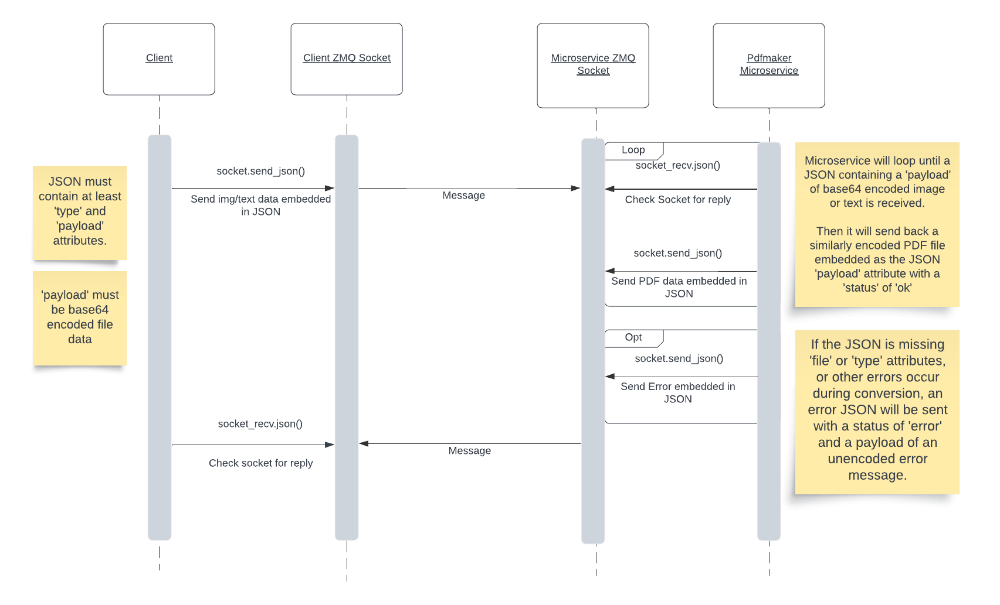

# Pdfmaker
ZeroMQ microservice for converting text or images to PDF

## Setup
1. Download repository
2. Install required libraries from requirements.txt
3. Set your desired Port number in pdfmaker.py
4. Run `pdfmaker.py`
5. The server is now listening for ZMQ messages on the chosen port

## How to Request Data from Microservice
### Overview
The client program needs to use ZMQ's `.send_json()` to send a JSON object to the server.\
The file data payload transmitted must be bytes-type data, encoded in base64 (see below for example)

### JSON format
#### Required
* **type:** Type of file to convert:
  * "text" - Text file. User must implement their own wrapping
  * "img" - Image file. PDF, PNG, and other PIL library supported file accepted.
* **payload:** Image or text data file, in bytes, encoded in base64(string)
#### Optional for text conversion
* **font:** Document font: [Courier, Helvetica, Arial, Times]
* **size:** Font size (in points)
* **[top, left, right]** Margins (cm)
Using a zeroMQ socket, the client program sends the JSON payload to the microservice and waits for a response

### Example Call to Microservice 
~~~
# Set up ZeroMQ Socket
context = zmq.Context()
socket = context.socket(zmq.REQ)
socket.connect("tcp://localhost:5555")

# Convert file to base64 encoded payload (example: an image file)
with open("example.jpg", "rb") as image_file:
    encoded_message = base64.b64encode(image_file.read()).decode('utf-8')
    
# Construct message JSON as a dictionary
message = {"type": "img", "payload": encoded_message}

# Send message via ZMQ pipeline
socket.send_json(message)
~~~

## How to Receive Data from Microservice
Call socket.recv_json() to receive a reply.
### Example Call (with decoding of successfully converted PDF data)
~~~
# Get reply from microservice
reply = socket.recv_json()

# Decode and write to a new pdf file
with open("example.pdf", "wb+") as pdf_file:
    decoded_file_data = base64.b64decode(reply['payload'])
    pdf_file.write(decoded_file_data)
~~~

### Reply JSON format
Once the text/image has been sent in the microservice, a JSON response is sent back to the client program that contains:
* status ["ok", "error"]
* payload
  * If successful, contains base64 encoded PDF file bytes
  * In case of an error, contains a short, unencoded error message

### Example Responses
~~~
# Success
{
  "status": "ok",
  "payload": "JVBERi0xLjQKJSBjcmVhdGV..."
}

#Failure
{
  "status": "error",
  "payload": "File type not recognized"
}
~~~
## UML Diagram
